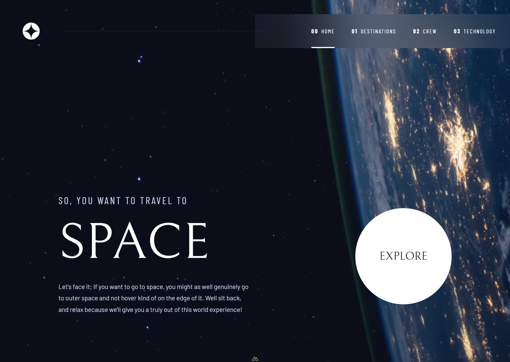

# Space Tourism Website



A modern responsive website built with **Nuxt**, **Vue**, and **SCSS**, inspired by the Space Tourism challenge.

This project focuses not only on building the UI but also exploring **SEO-friendly rendering strategies** for tab-based interfaces using **Static Site Generation (SSG)**.

## 🚀 Live Demo

https://space-tourism-ten-tawny.vercel.app/

## 🛠 Tech Stack

- Nuxt
- Vue
- SCSS

## 📌 Project Goal

The main goal of this project was to explore how **tab-based UI components** can be implemented without sacrificing **SEO crawlability**.

In many websites, tabs are often implemented purely with client-side state. While this provides a smooth UI experience, it can prevent search engines from discovering the content inside each tab.

This project experiments with a different approach: **combining tab navigation with route-based pages generated via SSG**.

## 🧠 Rendering Strategy

Instead of rendering all tab content inside a single page, each tab is mapped to its own **dedicated route**.

Example structure:

```
/destination
/destination/moon
/destination/mars
/destination/europa
/destination/titan
```

Although the interface visually behaves like a **tab component**, each tab actually corresponds to a **unique URL**.

During the build process, these routes are **statically generated**, allowing search engine crawlers to discover and index each piece of content.

## 🔍 SEO Considerations

To further improve crawlability and avoid SEO issues, several strategies were implemented:

### Dynamic Metadata

Each generated route has its own metadata such as:

- page title
- description

This allows each tab page to represent its content more accurately.

### Canonical URL Strategy

Since tab pages may contain closely related content, canonical URLs are used to point back to the parent page.

Example:

```
/destination/moon
/destination/mars
```

canonical →

```
/destination
```

This helps prevent potential **duplicate content issues** while still allowing crawlers to access the tab content.

## 🧩 Key Concept

The core idea explored in this project is:

```
UI Tabs
+
Route-based navigation
+
Static Site Generation
```

This approach allows the interface to maintain a **clean tab navigation experience** while ensuring that **all tab content remains crawlable and indexable by search engines**.

## 🎯 What I Learned

Through this project I explored:

- building responsive layouts with Vue
- implementing route-driven tab navigation
- using Static Site Generation for better performance
- applying SEO considerations in UI component design
